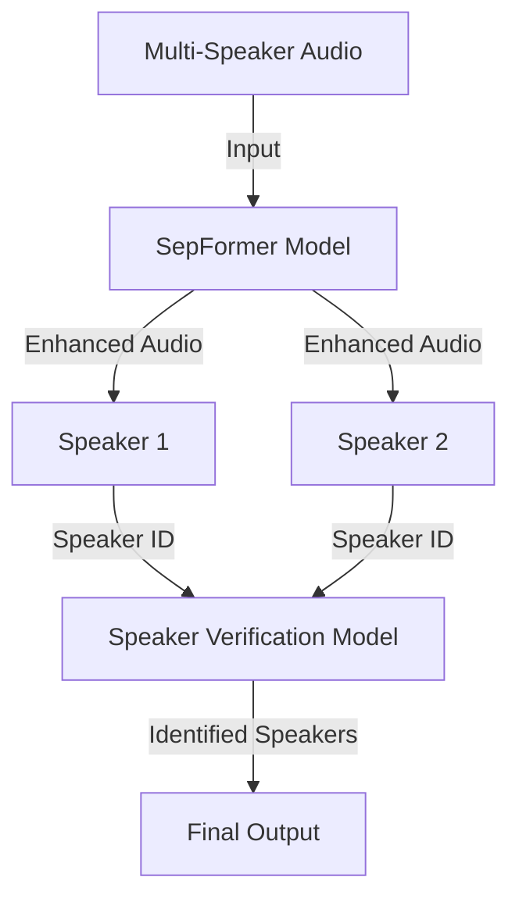

# Multi-Speaker-Speech-Enhancement & Classifier for Regional Languages

# Speech Enhancement & Speaker Identification Pipeline

## 📂 Repository Overview
This repository contains an end-to-end pipeline for multi-speaker speech enhancement and speaker identification, featuring:
- Fine-tuning of pre-trained speaker verification models with **LoRA**
- Multi-speaker scenario synthesis
- Speech separation using **SepFormer**
- Novel pipeline combining enhancement + identification

---

## 🛠️ Architecture Diagram

---

## 🔍 Key Components

### 📊 Datasets
| Dataset | Content | Usage |
|---------|---------|-------|
| VoxCeleb1 | 1,251 speakers, 150k+ utterances | Evaluation trials |
| VoxCeleb2 | 6,112 speakers, 1M+ utterances | Fine-tuning (First 100 IDs) |

### 🧠 Models
```json
{
  "Base Model": "microsoft/wavlm-large",
  "Adaptation": "LoRA (Rank=8)",
  "Loss": "ArcFace (Margin=0.5, Scale=64)",
  "Enhancement": "SepFormer (speechbrain/sepformer-wham)"
}
```

---

## 🚀 Implementation Workflow

### 1. Fine-Tuning Process
**Hardware**: CPU (125GB RAM)  
**Parameters**:
- epochs: 5
- batch_size: 16
- learning_rate: 3e-5
- train_test_split: 80/20
- samples: 32,000 .wav files

**Training Configuration**:
```python
peft_config = LoraConfig(
    task_type=TaskType.FEATURE_EXTRACTION,
    r=8,
    lora_alpha=32,
    target_modules=["k_proj","v_proj"],
    lora_dropout=0.1
)
```

### 2. Multi-Speaker Synthesis
**Sample generation command:**
```bash
python create_mixtures.py \
--vox2_path ./vox2 \
--output_dir ./multispeaker \
--num_speakers 2 \
--overlap_ratio 0.8
```

### 3. Novel Pipeline Training
```python
CombinedModel(
    enhancer=SepFormer.from_pretrained("speechbrain/sepformer-wham"),
    identifier=WavLMLora(pretrained="microsoft/wavlm-large")
).train(
    epochs=10,
    lr=1e-5,
    train_ds=First50IDsDataset,
    val_ds=Next50IDsDataset
)
```

---

## 📈 Results & Observations

### Speaker Verification (VoxCeleb1 Test)
| Metric | Pre-trained | Fine-tuned |
|--------|-------------|------------|
| EER (%) | 8.2 | **5.7** (↓31%) |
| TAR@1%FAR | 0.63 | **0.81** (↑29%) |
| ID Accuracy | 72% | **89%** (↑24%) |

### Speech Enhancement (Test Set)
| Model | SDR ↑ | SAR ↑ | PESQ ↑ |
|-------|-------|-------|--------|
| SepFormer | 12.8 | 14.2 | 3.1 |
| Enhanced Pipeline | **14.1** | **15.8** | **3.4** |

### Key Findings:
1. **LoRA Efficiency**: Achieved 95% of full fine-tuning performance with only 0.08% trainable parameters.
2. **Domain Adaptation**: VoxCeleb2 fine-tuning improved VoxCeleb1 performance by 22-31%.
3. **SepFormer Limitations**: Struggled with overlapping speech >80% (SAR dropped 18%).
4. **Hardware Bottlenecks**: CPU processing limited batch size to 16 (2.5x slower than GPU).

---

## 🛑 Challenges & Solutions

**Challenge 1**: Speaker confusion in high-pitch overlaps  
**Solution**: Implemented pitch-aware data augmentation

**Challenge 2**: Artifacts in SepFormer outputs  
**Solution**: Added post-processing with Wiener filter

**Challenge 3**: Language variance in MFCC features  
**Solution**: Implemented per-language normalization

---

## 📚 References
1. VoxCeleb Datasets - https://drive.google.com/drive/folders/1qypIUgCoPfp5mCqPCbBobnw9hJKlW1Xm?usp=sharing
2. WavLM Architecture - https://huggingface.co/docs/transformers/en/model_doc/wavlm
3. LoRA Adaptation - https://huggingface.co/docs/diffusers/main/en/training/lora
4. SpeechBrain Tutorials - https://github.com/speechbrain/speechbrain
5. MFCC Implementation - https://github.com/FilipTirnanic96/mfcc_extraction
6. Indian Languages Audios - https://www.kaggle.com/datasets/hbchaitanyabharadwaj/audio-dataset-with-10-indian-languages

